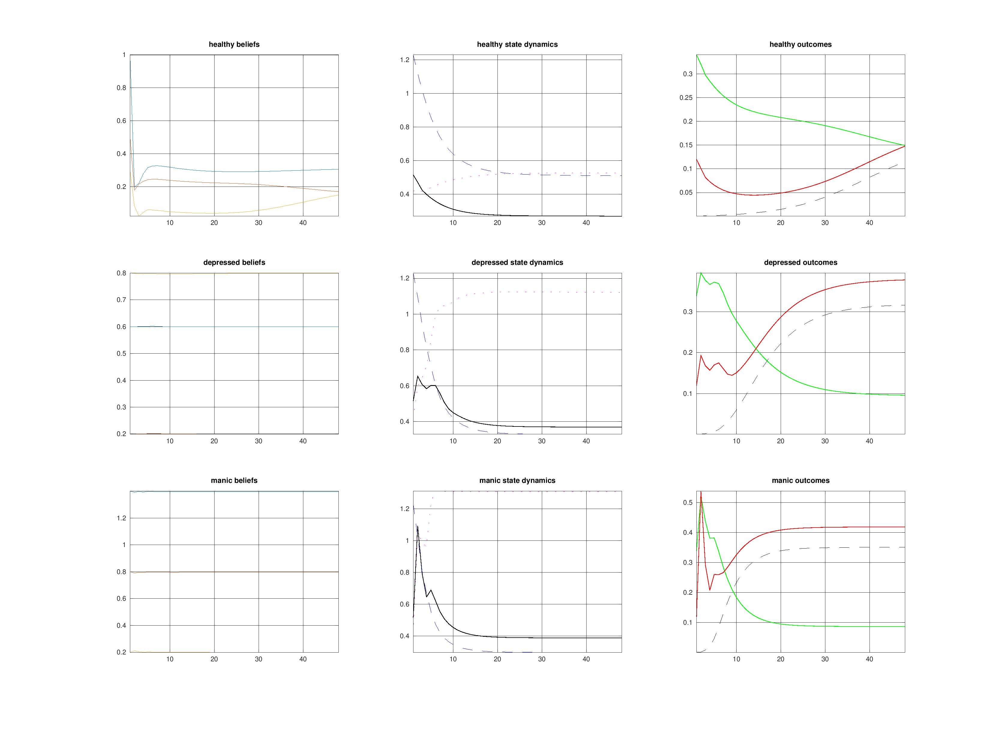

# Experiment 001: Add State Dynamics to the Psychology Model

Status: completed

Date: 2026-03-31

## Belief

The current psychology model collapses to flat lines because it has no hidden state dynamics.

All three regimes only differ in priors and precisions over hidden causes `v = [expected_energy, expected_reward, expected_fatigue]`. Since there is no `f(x, v, P)`, each time step is effectively memoryless. The model can correct belief error at one step, but it cannot carry forward depletion, recovery, or accumulated cost into the next.

If we want healthy pacing, depressive under-activation, and manic over-extension to emerge as trajectories instead of static set points, the model needs internal variables that evolve continuously.

## Action

Introduce hidden states `x` to both the generative process and generative model.

Current candidate state set:

- `x(1) = reserves` - available energy capacity
- `x(2) = fatigue` - accumulated cost / drag
- `x(3) = effort` - current expenditure level or activation state

Proposed role of each term:

- `reserves` deplete under sustained effort and recover during rest
- `fatigue` rises with exertion and decays slowly
- `effort` acts as the fast state that action pushes around, while reserves and fatigue provide slower memory

Planned process shape:

- `G(1).f`: action drives `effort`; `effort` drains `reserves`; `effort` accumulates `fatigue`
- `G(1).g`: observations remain `[energy, reward, fatigue]`, but now depend on hidden state

Planned model shape:

- `M(1).f`: mirrors the same state structure
- `M(1).g`: predicts observations from inferred `reserves`, `fatigue`, and `effort`
- regime priors continue to bias how worthwhile exertion is expected to be

## Expected

If the added state dynamics are doing the right job, we should see:

- Healthy: oscillation or at least repeated spend-rest-recover structure
- Depressed: fatigue expectation dominates, effort stays low, reward stays low, recovery is underused
- Manic: effort stays high too long, reserves deplete, reward saturates, then a crash follows

More specifically:

- `energy` should no longer be an independent per-step choice with no history
- `fatigue` should persist after expenditure instead of resetting instantly
- `reward` should become state-dependent, not just a static transform of current energy

## Observed

The first state-dynamics pass succeeded in one narrow sense and failed in the more important sense.

It did add temporal memory:

- `reserves` no longer reset every step
- `fatigue` persisted across time
- realized energy became history-dependent rather than a per-step independent choice

But it still did not produce the pacing behaviors we wanted:

- all three regimes remained too similar in their actual trajectories
- there was no clean healthy spend-rest-recover rhythm
- depressed and manic did not separate as underuse versus overspending styles
- action coupling was too weak or too easily absorbed by state inference

This made the model temporally smoother, but not psychologically sharper.

## Figure

## Update

Updated belief after implementing the first version:

- hidden states are necessary, but not sufficient
- a pure reserves-fatigue-effort model without structured opportunities tends to relax toward generic trajectories
- if we want cycles to emerge, the agent needs something to pace itself against

The important shift was conceptual: the right fast variable is not just `effort`, but `activation` in the presence of opportunities. Something can feel energizing in the moment while still drawing down longer-term reserves.

## Next

1. Add a deterministic stream of opportunity pulses.
2. Replace the old `effort` interpretation with `activation`.
3. Gate reward by opportunity so action is worthwhile only when something salient is happening.
4. Treat depressed and manic differences as pacing differences relative to the same opportunity stream.
