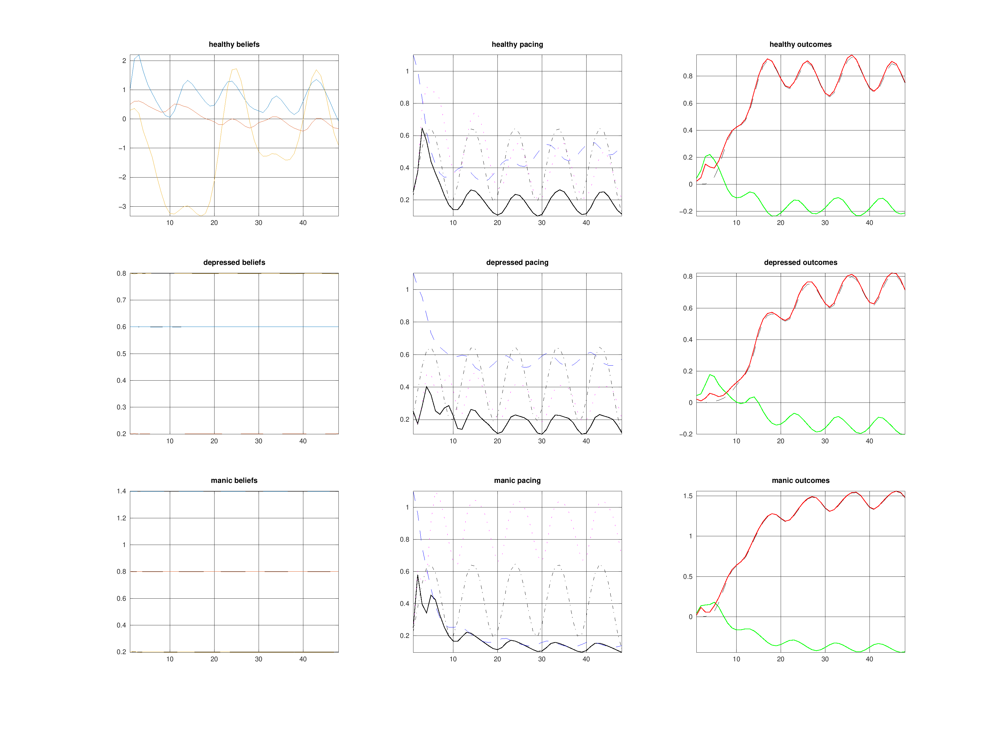

# Experiment 002: Opportunity-Gated Pacing

Status: running

Date: 2026-03-31

## Belief

The first stateful model had memory, but not enough structure to generate psychologically distinct pacing styles.

The revised belief is:

- `reserves` are slow capacity
- `fatigue` is slow cost accumulation
- `activation` is fast felt readiness
- `opportunities` are pulses the agent can act on or ignore

Reward should not be a static transform of energy alone. Energy spent on a salient opportunity feels different from energy spent into the void. Activity can therefore be energizing in the moment while still burning through reserves and building fatigue underneath.

## Action

Refactor the model around opportunity-gated pacing.

Core changes:

- add a deterministic pulse train of opportunities over time
- let both process and model carry `reserves`, `fatigue`, and `activation`
- make action change realized activation directly enough to matter to `spm_ADEM`
- gate reward by opportunity
- expose `activation` and `opportunity` in extracted traces and the web payload

This keeps the model simpler than a circadian formulation. There is still no prescribed day/night rhythm. The environment simply presents repeated chances to spend energy.

## Expected

If the new framing is correct:

- healthy should show repeated engagement and partial recovery across opportunity pulses
- depressed should underuse available opportunities and preserve more reserves, but at the cost of lower reward
- manic should overspend into opportunities, accumulate much more fatigue, and run reserves down hardest

The key test is whether the same environment now yields different pacing signatures rather than one shared trajectory.

## Observed

Current headless runs show the intended qualitative separation, but not yet a finished model.

Healthy:

- tracks the opportunity pulses with repeated bursts of activation
- depletes reserves, then partially recovers
- free energy decreases strongly overall

Depressed:

- engages less strongly than healthy
- keeps higher reserves than manic
- still does not undershoot as much as desired
- free energy can still rise overall under the current preset

Manic:

- drives action and activation hardest
- reaches the highest fatigue by a wide margin
- runs reserves closest to exhaustion
- free energy decreases overall, but the cost profile is pathological

## Figure

## Update

This version is close to the right abstraction.

What now seems correct:

- opportunity pulses are enough to create pacing structure without imposing circadian semantics
- `activation` is a better fast state than `effort`
- reward should be opportunity-gated

What still looks incomplete:

- depressed behavior is not yet sufficiently inertial or self-neglecting
- a slow deconditioning / maintenance variable may still be needed to capture atrophy from chronic underuse
- the depressed preset still has a free-energy problem, which means the current belief-action geometry is not fully right

## Next

1. Tune the depressed preset so underuse is more stable than partial engagement.
2. Decide whether deconditioning should be a fourth state or a dynamic reserve ceiling.
3. Export figures automatically after model changes so the docs stay current.
