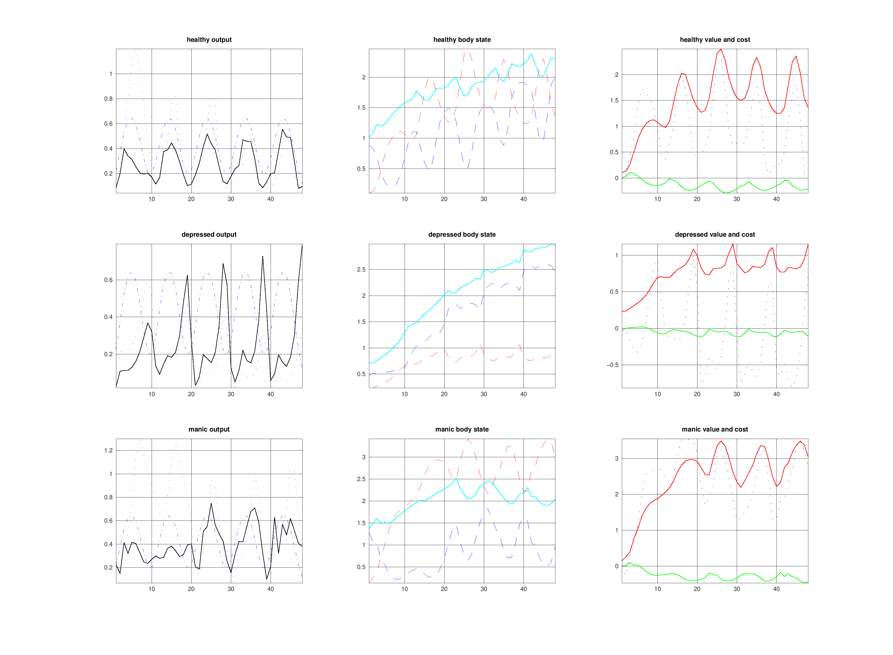

# Experiment 003: Body/Self-Model Split

Status: completed

Date: 2026-03-31

## Belief

The opportunity-pacing model found the right fast ingredients, but it still treated the body as too static.

The revised belief is:

- the generative process `G` should represent bodily reality
- the generative model `M` should represent the person's beliefs about that body
- `reserves` should recover toward a slower-changing `capacity`, not toward a fixed constant
- chronic underuse should be able to atrophy capacity
- chronic overuse should be able to damage capacity

This is the first experiment where the process/model boundary becomes the main design object instead of an implementation detail.

## Action

Refactor the current model around an explicit body/self-model split.

Core changes:

- split the parameter sets into `PG` for bodily reality and `PM` for bodily belief
- add a fourth hidden state, `capacity`, to both process and model dynamics
- let `reserves` recover toward `capacity`
- let `capacity` change slowly through homeostasis, moderate-use build, underuse atrophy, and overuse damage
- derive different initial body states and belief distortions from the regime bias

State interpretation in the current code:

- `x(1) = reserves` - currently available expendable energy
- `x(2) = fatigue` - accumulated bodily cost
- `x(3) = activation` - fast felt readiness or mobilization
- `x(4) = capacity` - slower bodily ability to restore reserves

Observation interpretation in the current code:

- `energy` - realized bodily output, approximately `reserves * activation`
- `reward` - opportunity-gated payoff minus fatigue penalty
- `fatigue` - felt cost signal
- `opportunity` - current environmental salience

## Expected

If this body/self-model split is doing the right job:

- healthy should show repeated engagement with recovery and roughly stable capacity
- depressed should under-engage, neglect maintenance, and drift toward lower capacity over time
- manic should show genuinely elevated short-run output, then pay for it through depletion and damage

Conceptually, we also expect a cleaner separation between:

- felt readiness (`activation`)
- realized output (`energy`)
- incentive or payoff (`reward`)

## Observed

The architecture improved, but the numbers are not yet aligned with the intended psychology.

What improved:

- the body/self-model split is now explicit in the code
- manic now produces genuinely higher actual energy than the other regimes, not just higher attempted action
- the model now has a place for bodily history to matter beyond momentary pacing

What still fails:

- depressed is still too active relative to intuition
- `capacity` currently rises in all three regimes instead of atrophying under depressed underuse
- manic has higher actual output, but the observed `reward` does not yet show the expected euphoric bump
- the current observation vocabulary still blurs together distinct psychological ideas

The main mismatch is that `reward` is doing too much work. Right now it is part payoff, part incentive signal, while `activation` is carrying something closer to felt vigor and `energy` is carrying actual bodily expenditure.

## Figure

## Update

This experiment clarified the architecture more than it clarified the phenomenology.

Updated belief after running it:

- the body/process split is the right direction and should stay
- the next conceptual cleanup is not about adding more states first, but about naming and separating the current ones properly
- if we want mania to feel energized in the observations, we may need an explicit observed activation or interoceptive arousal channel instead of expecting `reward` to carry that burden

Working vocabulary going forward:

- `activation`: "I feel mobilized / energized right now"
- `energy`: "my body is actually producing output right now"
- `reward`: "acting here seems or feels worthwhile"

That vocabulary is not fully implemented yet, but it is the right conceptual target.

## Next

1. Tune `capacity` dynamics so depressed underuse can really atrophy and manic overuse can really damage.
2. Add an explicit felt-energy observation distinct from reward.
3. Revisit how `expected_reward` is represented so it means incentive value, not raw bodily energy.
