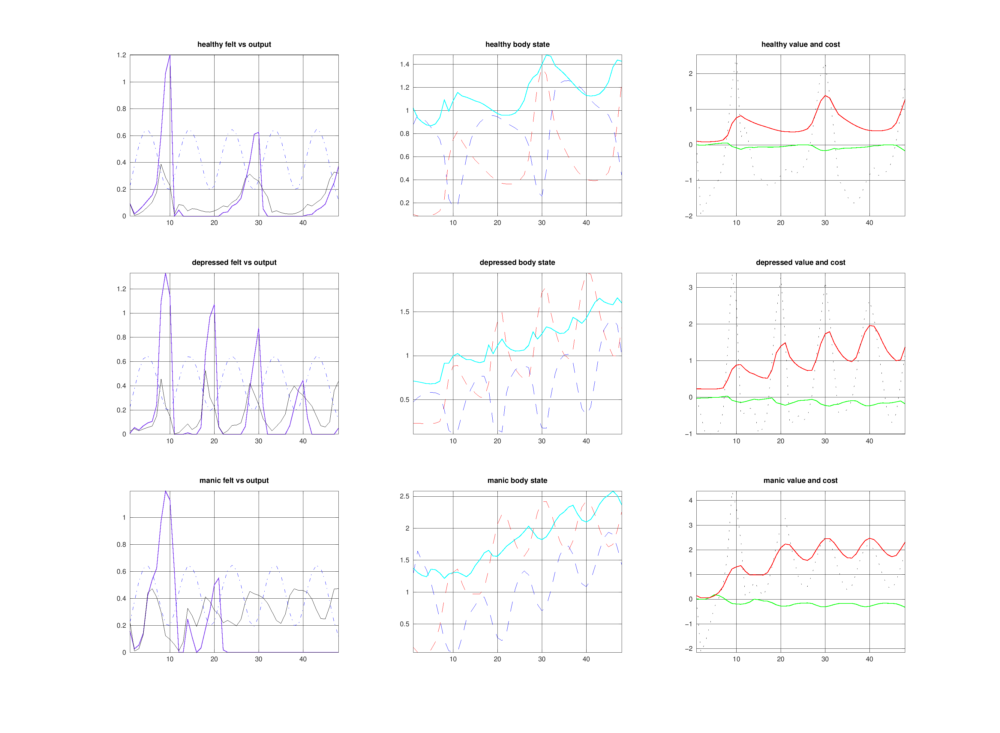

# Experiment 004: Felt-Energy Observation

Status: completed

Date: 2026-03-31

## Belief

The current model still mixes together three different things:

- felt mobilization
- actual bodily output
- incentive or payoff

That makes the manic regime hard to read. A manic body can feel highly energized even when reward is already flattening or turning negative. If the observation model does not contain a distinct felt-energy channel, the model is forced to overload either `reward` or `energy` with the wrong meaning.

## Action

Add a separate `feltEnergy` observation to both the generative process and the generative model.

Current interpretation:

- `activation` remains the fast latent state of mobilization
- `feltEnergy` is the interoceptive observation of that mobilization, discounted by fatigue
- `energy` remains realized bodily output
- `reward` remains opportunity-gated payoff

The first belief dimension is now best read as expected vitality rather than expected output.

## Expected

If this split is correct:

- manic should show higher felt energy than healthy, even when reward does not increase proportionally
- depressed should show low felt energy even when some reserves remain available
- the charts should be easier to read because vigor, output, and value are no longer being forced into one line

## Observed

The code now exposes a distinct `feltEnergy` channel and routes it through extraction, JSON output, and the web UI.

This fixes the conceptual ambiguity, but it does not yet solve the behavioral tuning problem:

- depressed still needs stronger underuse and atrophy dynamics
- manic still needs a more plausible short-run lift versus long-run sustainability tradeoff
- the first belief dimension is still named `energy` in the transport layer even though its meaning is now closer to vitality

## Figure

## Update

The model is now conceptually cleaner:

- `activation`: latent mobilization state
- `feltEnergy`: sensed energizedness
- `energy`: realized output
- `reward`: value/payoff

That is a better psychology.

The next step is numerical rather than conceptual: tune the body dynamics so the new vocabulary produces the regime patterns we actually expect.

## Next

1. Retune `capacityBuild`, `capacityAtrophy`, and `capacityDamage`.
2. Make action efficacy depend on bodily condition rather than letting depleted bodies mobilize unrealistically well.
3. Decide whether the transport/UI layer should rename the first belief from energy to vitality.
