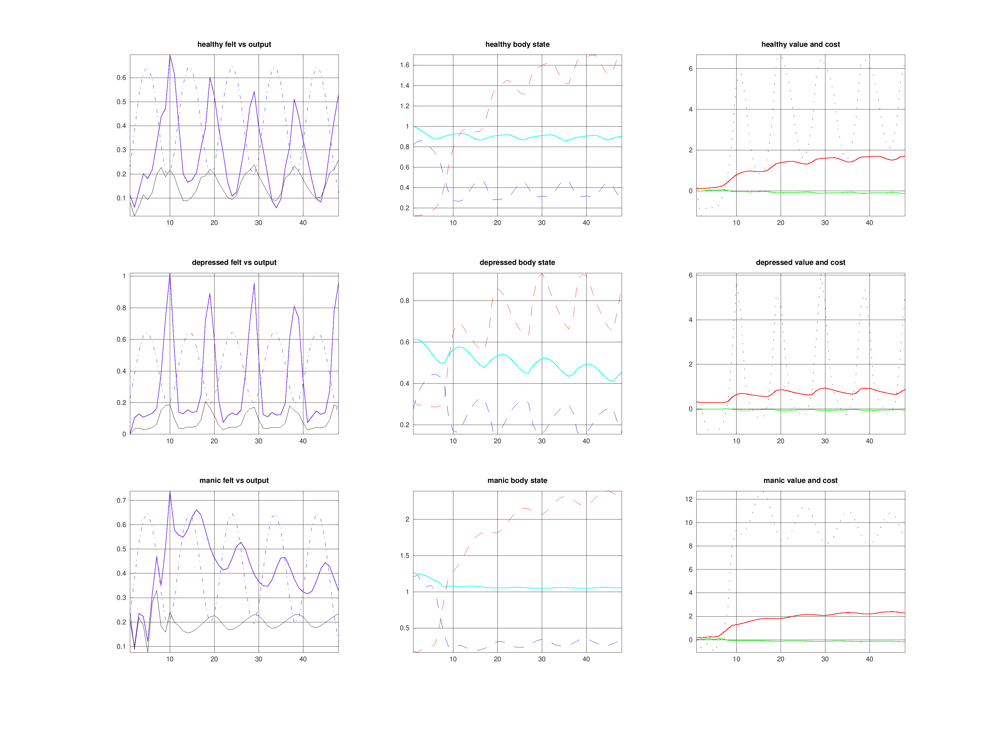

# Experiment 005: Body-Limited Mobilization

Status: completed

Date: 2026-03-31

## Belief

The felt-energy split clarified the vocabulary, but it exposed a deeper mechanical problem.

Action could still push activation too effectively even when reserves were low. That made depressed bodies look too mobilized and let manic bodies keep driving output without enough bodily resistance. The slow `capacity` law also treated low output as a problem at every timestep, including off-opportunity periods that should count as ordinary rest rather than pathological underuse.

## Action

Refine the body mechanics in two linked ways:

- make action efficacy depend on bodily leverage, defined by available reserves relative to capacity
- gate capacity build, underuse, and overuse by opportunity so adaptation happens when there is something to respond to
- retune the slow capacity parameters so healthy stays nearer baseline, depressed can atrophy, and manic pays a stronger long-run cost

This keeps the same state set:

- `reserves`
- `fatigue`
- `activation`
- `capacity`

But it changes the interpretation of action: the agent can try to mobilize, yet the body only converts that attempt into activation in proportion to what is physically available.

## Expected

If this refinement is correct:

- healthy should show moderate felt energy and output with only mild capacity drift
- depressed should no longer spike above healthy just because action can overpower the body
- manic should still get the highest short-run output and reward, but at the cost of the highest fatigue and some capacity loss

## Observed

The new action interface behaves more plausibly than the previous version.

Current 48-step summaries:

- healthy: `energy_peak ~= 0.259`, `capacity 1.000 -> 0.901`, `fatigue_peak ~= 1.700`
- depressed: `energy_peak ~= 0.207`, `capacity 0.615 -> 0.454`, `fatigue_peak ~= 0.934`
- manic: `energy_peak ~= 0.330`, `capacity 1.259 -> 1.053`, `fatigue_peak ~= 2.388`

What now matches intuition better:

- depressed actual output is below healthy
- depressed capacity now trends downward instead of falsely training upward
- manic has the highest output, highest reward peak, and highest fatigue cost
- manic also shows real capacity erosion rather than indefinite strengthening

What still looks incomplete:

- depressed felt energy is still higher than healthy more often than we would like
- manic is only modestly above healthy in peak output, not dramatically elevated
- free-energy traces are still not clean qualitative diagnostics by themselves

## Figure

## Update

This is the first version where the body pushes back in the right place: at the action interface, not only downstream in the observation curves.

That is a real conceptual improvement. The next uncertainty is no longer "should the body limit action?" but "how strong should that limit be, and how should depressed subjective vitality be damped without destroying the healthy/manic separation?"

## Next

1. Tune the felt-energy observation so depressed subjective vitality is lower without flattening healthy and manic.
2. Decide whether manic needs a more pronounced short-run reserve advantage to produce a stronger high before the crash.
3. Consider renaming the first belief dimension from `energy` to `vitality` across the transport layer.
