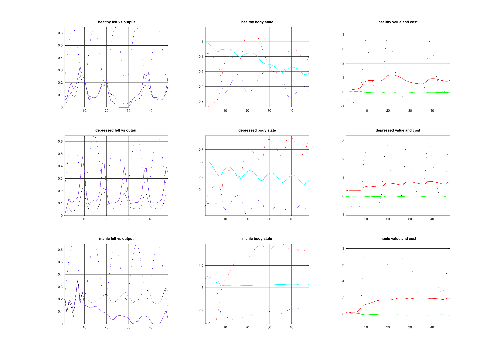

# Experiment 006: Felt-Energy Damping

Status: completed

Date: 2026-03-31

## Belief

The current body-limited mobilization model is better behaved, but depressed subjective vitality is still too high.

The likely reason is that `feltEnergy` is still too close to raw activation. A depleted or atrophied body should not feel equally energized just because activation has been momentarily mobilized. Subjective vitality should depend on how much bodily support is actually available.

## Action

Refine the `feltEnergy` observation so it depends on bodily availability, not just activation.

Current intervention:

- keep `activation` as the latent mobilization state
- keep `energy` as realized output
- scale `feltEnergy` by the ratio of `reserves` to `capacity`
- retain the opportunity boost and fatigue penalty

This means the body can still be pushed into activation, but a depleted body will report less felt vitality than a well-supported one.

## Expected

If this is the right refinement:

- depressed `feltEnergy` should fall below healthy more reliably
- manic should preserve a stronger early vitality advantage because its initial reserve support is better
- healthy should remain in the middle without collapsing into flat low vitality

## Observed

The damping changed the curves in the intended direction, but too globally.

Current 48-step summaries:

- healthy: `felt_peak ~= 0.332`, `energy_peak ~= 0.265`, `capacity 1.000 -> 0.577`
- depressed: `felt_peak ~= 0.478`, `energy_peak ~= 0.226`, `capacity 0.615 -> 0.474`
- manic: `felt_peak ~= 0.363`, `energy_peak ~= 0.371`, `capacity 1.259 -> 1.064`

What improved:

- depressed subjective vitality is no longer implausibly high
- depressed still sits below healthy on actual output
- manic still has the highest output and reward peak

What failed:

- manic lost too much of its felt-energy advantage
- healthy also flattened more than intended
- healthy capacity now erodes too strongly during a run that should look more sustainable

## Figure

## Update

This pass was useful, but it overcorrected.

Reserve-scaling `feltEnergy` is the right idea, but the current damping is too strong and makes the subjective side of the model too uniformly muted. The next step should not be to remove bodily availability from `feltEnergy`, but to make that influence softer or more nonlinear so depressed is damped more selectively than healthy and manic.

## Next

1. Soften the reserve-scaling of `feltEnergy` so manic regains a clearer early vitality advantage.
2. Reduce healthy capacity erosion so the baseline regime looks more sustainable again.
3. Only after that, consider renaming the first belief dimension from `energy` to `vitality`.
